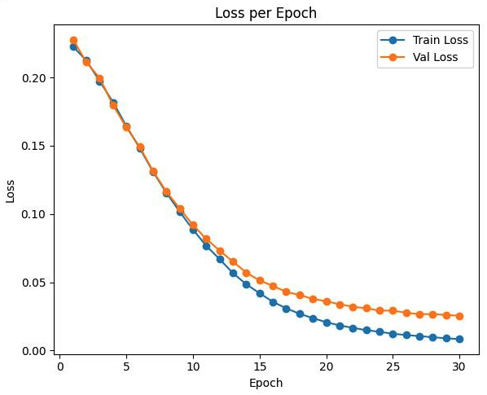
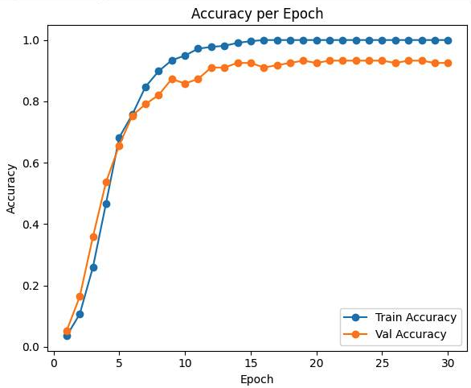

# NLP Проект: Классификация научных статей по медицине катастроф  

Данный проект посвящен классификации научных статей, связанных с медициной катастроф. Основные этапы работы включают генерацию недостающих текстов для сбалансированности классов, дообучение предобученной модели RuBERT и подбор гиперпараметров с использованием Optuna.  
## 1. Структура проекта

- **src/**: Основной код проекта.
  - **train.py**: Содержит логику обучения модели.
  - **evaluate.py**: Проводит оценку модели, строит графики точности и потерь.
  - **utils.py**: Вспомогательные функции для загрузки данных, подсчета метрик и сохранения/загрузки модели.
  - **test.py**: Файл для тестирования на новых данных.

- **models/**: Сохраненные модели с обученными весами.
  - **rubert_classification.bin**: Обученная модель.

- **requirements.txt**: Список зависимостей, необходимых для работы проекта.

- **README.md**: Описание проекта, инструкции по использованию.

---

## **2. Описание проекта**  
Цель проекта — классификация научных статей на заданные категории с использованием методов глубокого обучения и обработки естественного языка.  
### Основные задачи:  
- Решение проблемы несбалансированности данных за счет генерации текстов для классов с малым количеством данных.  
- Дообучение мощной предобученной языковой модели (`DeepPavlov/rubert-base-cased`) на текущем датасете для повышения качества классификации.  
- Оптимизация гиперпараметров с помощью Optuna для улучшения производительности модели.  

---

## **3. Предобработка и дополнение данных**  
1. **Датасет**:  
   - Данные включают статьи, разделенные на 46 категорий.  
   - В некоторых классах наблюдался значительный дисбаланс (недостаток примеров).  

2. **Генерация текстов**:  
   - Для балансировки данных использовалась модель `sberbank-ai/rugpt3small_based_on_gpt2`.  
   - Генерированные тексты добавлены в тренировочный набор данных.  

---

## **4. Описание моделей**  
### **4.1 Модель генерации текста**  
- **Модель**: `sberbank-ai/rugpt3small_based_on_gpt2`  
- **Назначение**: Генерация дополнительных текстов для классов с недостатком данных.  

### **4.2 Модель классификации**  
- **Модель**: `DeepPavlov/rubert-base-cased`  
- **Назначение**: Классификация научных статей на 46 категорий.  
- **Дообучение**:  
  - Модель дообучалась на текущем датасете (включая сгенерированные тексты) с использованием функции потерь кросс-энтропии.  
  - Для повышения надежности применялась 5-кратная кросс-валидация.  

---

## **5. Оптимизация гиперпараметров**  
### **5.1 Инструмент для оптимизации**  
- **Optuna**: Фреймворк для автоматического подбора гиперпараметров.  
- **Цель**: Максимизировать точность классификации, оптимизировав следующие параметры:  
  - Скорость обучения  
  - Размер батча  
  - Количество эпох  
  - Максимальная длина последовательности (`max_len`)  
  - Тип шедулера  

### **5.2 Подобранные параметры**  
Оптимальные параметры, подобранные с помощью Optuna:  
- Скорость обучения: `1.0586776e-05`  
- Размер батча: `16`  
- Количество эпох: `30`  
- Максимальная длина последовательности (`max_len`): `512`  
- Шедулер: `CosineAnnealingLR`  
- L2-регуляризация (weight decay): `1e-6`  

---

### График потерь



### График точности



---

## Использование

1. Клонируйте репозиторий:
   ```bash
   git clone https://github.com/Arteeemiy/Classification-of-Scientific-Articles-on-Disaster-Medicine.git
   cd your-repository
2. Установите зависимости:
   ```bash
   pip install -r requirements.txt
3. Используйте модель для работы на новых данных:
   ```bash
   python src/test.py
